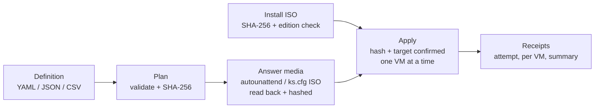

# Multi Install ISO

Build fresh VMs from installation ISOs, without templates or golden images: describe the VMs, get a reviewed plan with a hash, build unattended answer media, and apply it to vSphere or local Hyper-V with a receipt for every step.

> **Status (0.9.0):** planning, validation, answer-media ISOs, install-ISO checks, and the desktop app are proven offline on Windows. **No VM has been built yet**: the vSphere and Hyper-V apply paths, and Windows Setup / Anaconda using the generated media, have not been run. See [docs/EVALUATION.md](docs/EVALUATION.md).

## How it works



## Desktop app

`dist\MultiInstallIso-<version>-win-x64\MultiInstallIso.exe` (built by `build.cmd`). Pages: Overview, Definition (edit, plan), Plan, Answer media, Install ISOs, Apply (readiness and the exact command), Runs, Dependencies, Settings.

- Liquid Glass look with Settings for glass on/off, opacity, and blur (and Reset). Turns solid automatically when Windows transparency is off, high contrast or forced colours are on, or blur is unavailable.
- Native title bar. Tray icon with version, Show, Hide, Close to tray (on by default), and Exit. A second launch brings back the running window.
- Version button with the Glimmer orb; it reflects real busy, success, and error state.
- Credentials for answer media are entered in a native dialog and passed to the engine on stdin.
- `MultiInstallIso.exe --smoke` runs an offline self-check, including a real plan and answer-media build. `--snapshot <png> [--glass on|off] [--view <page>]` renders a page to an image.

## Command line

```powershell
pwsh -File .\Build-Cluster.ps1 -DefinitionPath .\cluster-vms.yaml -PlanOnly                     # plan
pwsh -File .\Build-Cluster.ps1 -Mode Media -PlanPath <plan> -PlanHash <sha256> -AdminCredential (Get-Credential Administrator)
pwsh -File .\Build-Cluster.ps1 -Mode VerifyMedia -PlanPath <plan>
pwsh -File .\Build-Cluster.ps1 -Mode InspectIso -IsoPath <iso> -ExpectedSha256 <sha256> -ImageName "Windows Server 2022 SERVERSTANDARD"
pwsh -File .\Build-Cluster.ps1 -Mode Apply -PlanPath <plan> -PlanHash <sha256> -ConfirmTarget <vcenter-or-computer>
pwsh -File .\Build-Cluster.ps1 -Mode Dependencies
```

Add `-Json` for machine-readable output. Exit codes: 0 success, 1 blocking issue or failed check, 2 error. The full procedure is in [docs/RUNBOOK.md](docs/RUNBOOK.md).

## Repository

| Path | Purpose |
| --- | --- |
| `Build-Cluster.ps1` | Command-line entry point |
| `powershell\MultiInstallIso\` | Engine module: YAML reader, validation, plans, answer files, ISO writer/reader, media, apply, providers, dependency map |
| `guest\PostDeploy.ps1` | Runs inside new Windows VMs at first logon (Windows PowerShell 5.1) |
| `src\MultiInstallIso.App\` | .NET 10 WPF + WebView2 desktop app |
| `cluster-vms.yaml`, `examples\`, `templates\` | Sample definitions |
| `schemas\` | JSON schemas |
| `tests\Run-Tests.ps1` | Offline test suite (no extra modules) |
| `adapters\` | Terraform, Kubernetes, and Azure Pipelines (plan-only) adapters |
| `tools\` | Release build and icon generation |
| `legacy\` | Retired scripts kept for reference |
| `docs\` | Runbook, prerequisites, definition guide, evaluation, plan |

## Build

```bat
build.cmd
```

Checks that the version in `Directory.Build.props` matches the module manifest and has a CHANGELOG entry, runs the tests, publishes a self-contained single-file exe to `dist\MultiInstallIso-<version>-win-x64\`, smoke-tests the published exe, then writes a zip and SHA-256 sums.

Tests alone: `pwsh -File .\tests\Run-Tests.ps1`.

## Security

- Definitions never hold secrets; fields that look like secrets are rejected.
- Answer media holds credentials (the admin password is encoded, not encrypted; domain join is plain text, as Windows requires). It is written to a folder limited to you, SYSTEM, and Administrators. Delete it after the build.
- Install ISOs are verified against the publisher's SHA-256 before use. Nothing is downloaded or installed implicitly.

Report vulnerabilities privately; see [SECURITY.md](SECURITY.md).

## Disclaimer

This tool creates and powers on virtual machines and writes credentials onto installation media. It is provided "as is", without warranty of any kind (see [LICENSE](LICENSE)). Test every definition against non-production infrastructure first; you are responsible for what it builds. Not affiliated with or endorsed by Broadcom/VMware, Microsoft, Red Hat, or the Rocky and Alma projects; product names describe compatibility only.

## Credits and license

MIT. Copyright (c) 2019-2026 mikedopp. See [LICENSE](LICENSE).

The release build redistributes the .NET runtime (MIT), the WebView2 SDK loader (BSD-3-Clause), and the Glimmer version orb (MIT, after "orb" by LerSent001, MIT) with its editor's libraries. Every component and its license text is listed in [THIRD_PARTY_NOTICES.md](THIRD_PARTY_NOTICES.md) and [licenses/](licenses).
