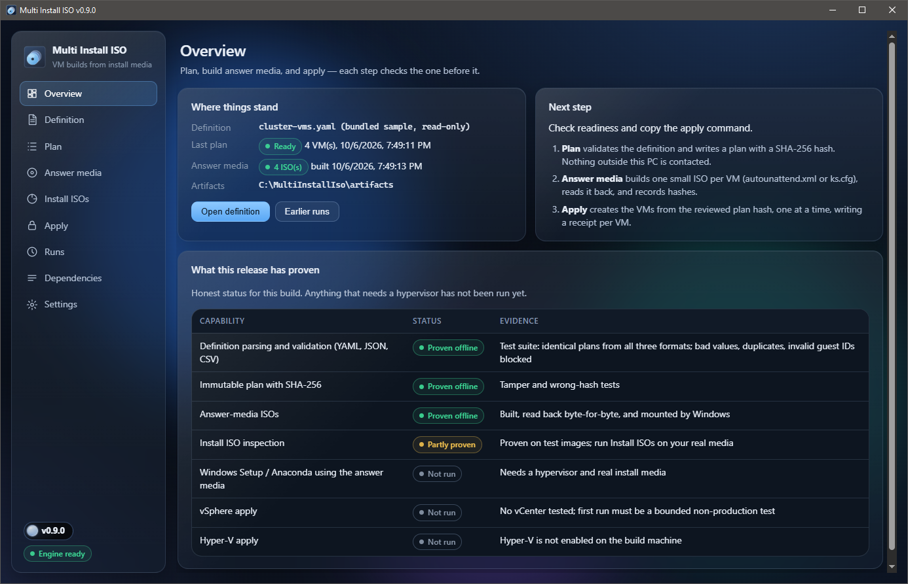
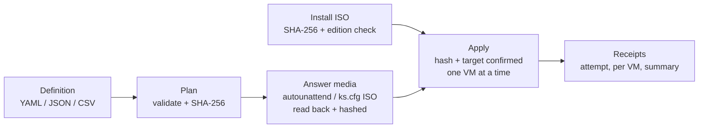
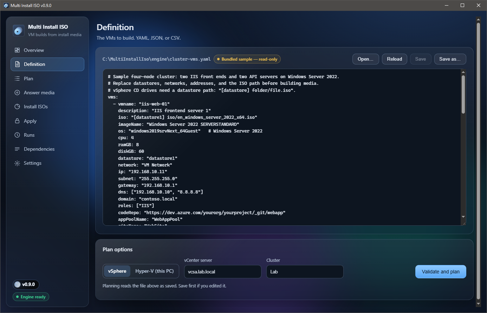
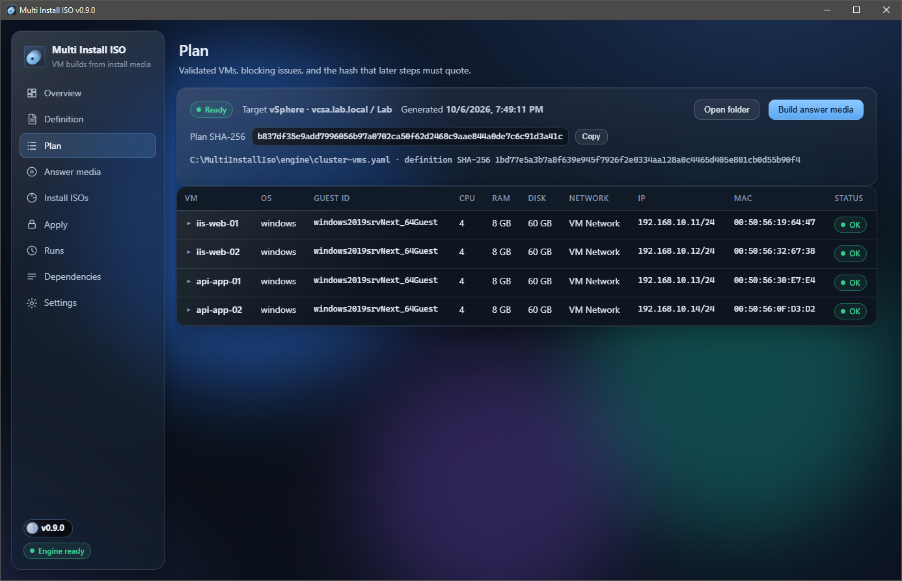
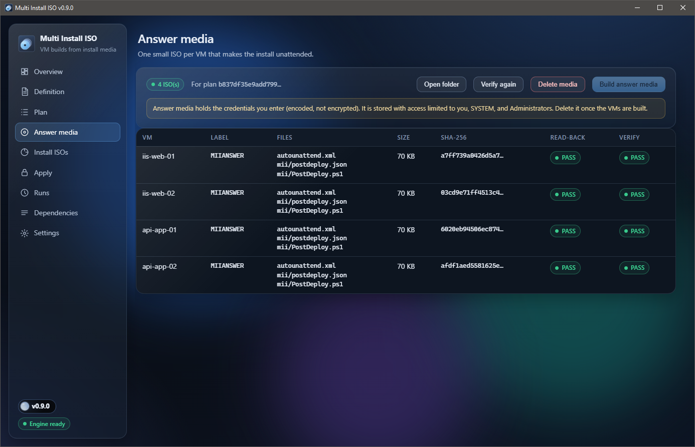
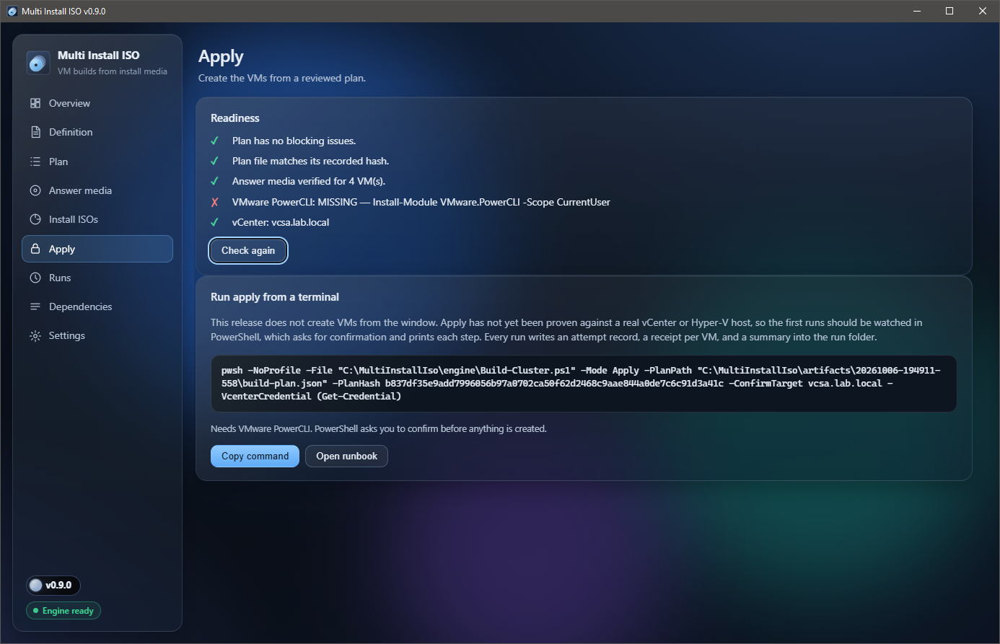
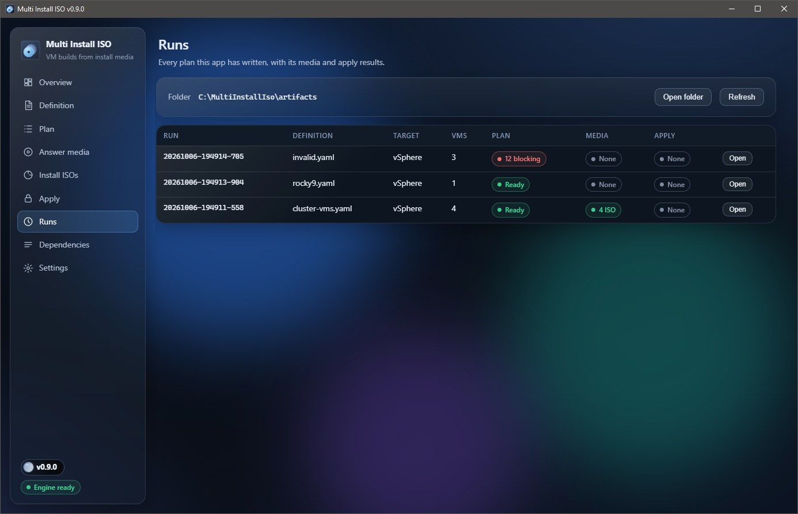
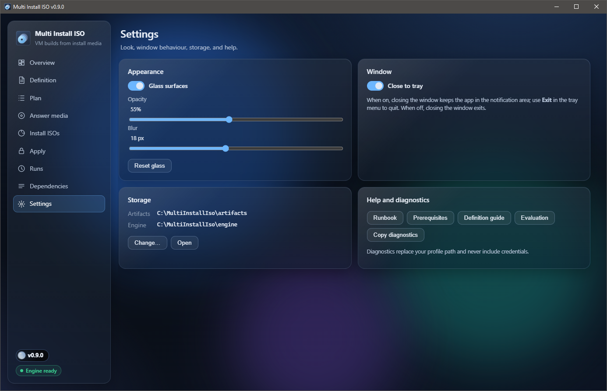
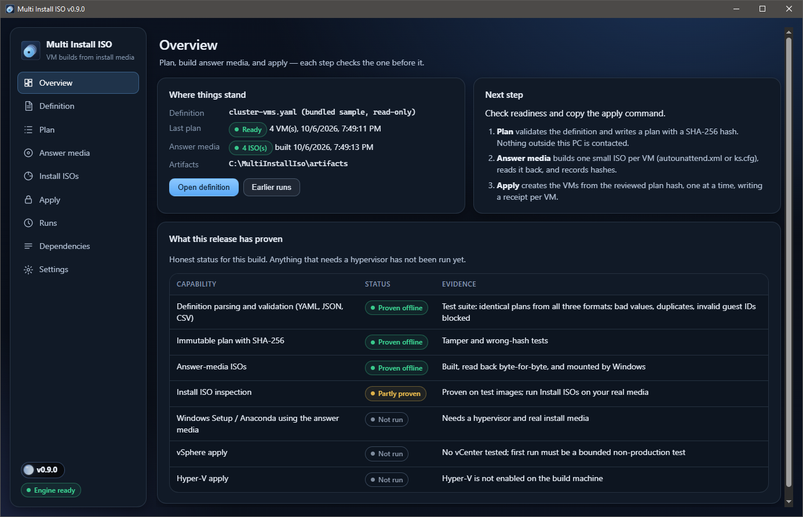

# Multi Install ISO

The engine (or glue) that pollutes vSphere — and now Hyper-V — with brand-new servers, straight from install ISOs. No templates. No golden images. No "who touched the base image" meetings.

Describe the VMs, get a plan with a hash, build the unattended answer media, then apply it with a receipt for every step. When it breaks, and it will, you'll know exactly where.



> **Status (0.9.0, prerelease):** planning, validation, answer-media ISOs, install-ISO checks, and the desktop app are proven offline on Windows. **No VM has been built with this release yet.** The vSphere and Hyper-V apply paths, and Windows Setup or Anaconda actually eating the generated media, have not been run. Optimism is not evidence. See [docs/EVALUATION.md](docs/EVALUATION.md).

## The scenario

You need four Windows servers by 5 PM: two IIS, two API. Patched, domain-joined, code pulled. The dev team is waiting to break them with horrible code, and your bonus is on the line.

You could click through Windows Setup four times. Or:



1. **Plan.** Reads your definition, tells you everything wrong with it (the old samples used a vSphere guest ID that doesn't exist — nobody noticed for years), and writes a read-only plan with a SHA-256.
2. **Answer media.** One tiny ISO per VM with `autounattend.xml` (Windows) or `ks.cfg` (Rocky/Alma/RHEL). Built, read back byte-for-byte, hashed, and locked down because it holds passwords.
3. **Apply.** Creates the VMs one at a time, but only if you quote the plan hash and name the target out loud. Writes an attempt record before it touches anything and a receipt after every step. Stops at the first failure and doesn't "helpfully" delete anything.

## Desktop app

`dist\MultiInstallIso-<version>-win-x64\MultiInstallIso.exe` (built by `build.cmd`), or grab the zip from Releases.

- Pages: Overview, Definition (edit and plan), Plan, Answer media, Install ISOs, Apply, Runs, Dependencies, Settings.
- Liquid Glass, because apparently everything is glass now. Settings for on/off, opacity, blur, and Reset. Goes solid on its own when Windows transparency is off, high contrast or forced colours are on, or blur isn't available.
- Native title bar. Tray icon with Show, Hide, Close to tray (on by default), and Exit. Launch it twice and you get the same window back, not two.
- The version button has the Glimmer orb. It thinks when the app is working, flashes when it's done, and turns red when something failed. More honest than most status pages.
- Credentials go into a native dialog and reach the engine on stdin. They never touch the web UI, a command line, or a log.
- Apply isn't run from the window yet. It hands you the exact command to run in a terminal, because the first real run deserves a human watching it.
- `MultiInstallIso.exe --smoke` runs a self-check, including a real plan and answer-media build. `--snapshot <png> [--glass on|off] [--view <page>]` renders a page to an image.

## Screenshots

The real app, captured on Windows 10. No mockups were harmed.

| | |
| --- | --- |
|  |  |
| **Definition.** Edit YAML, pick vSphere or Hyper-V, plan. Bundled samples are read-only so you can't ruin them. | **Plan.** Four servers, zero blocking issues, one SHA-256 you'll be quoting for the rest of the day. |
|  |  |
| **Answer media.** One ISO per VM, read back and verified. The yellow box is the part where it holds your passwords. | **Apply.** Readiness checklist, plus the exact command to run. It politely points out you haven't installed PowerCLI. |
|  |  |
| **Runs.** Every plan you've ever written, including the one with 12 blocking issues. We don't talk about that one. | **Settings.** Glass, opacity, blur, close to tray, and where everything lives. |

Glass on, glass off. For people who think translucency is a personality:

| Glass on | Glass off |
| --- | --- |
|  |  |

## Command line

```powershell
pwsh -File .\Build-Cluster.ps1 -DefinitionPath .\cluster-vms.yaml -PlanOnly
pwsh -File .\Build-Cluster.ps1 -Mode Media -PlanPath <plan> -PlanHash <sha256> -AdminCredential (Get-Credential Administrator)
pwsh -File .\Build-Cluster.ps1 -Mode VerifyMedia -PlanPath <plan>
pwsh -File .\Build-Cluster.ps1 -Mode InspectIso -IsoPath <iso> -ExpectedSha256 <sha256> -ImageName "Windows Server 2022 SERVERSTANDARD"
pwsh -File .\Build-Cluster.ps1 -Mode Apply -PlanPath <plan> -PlanHash <sha256> -ConfirmTarget <vcenter-or-computer>
pwsh -File .\Build-Cluster.ps1 -Mode Dependencies
```

Add `-Json` if a machine is reading. Exit codes: 0 fine, 1 your definition or media has a problem, 2 something actually broke. The full walkthrough is in [docs/RUNBOOK.md](docs/RUNBOOK.md).

## What's in here

| Path | Purpose |
| --- | --- |
| `Build-Cluster.ps1` | Command-line entry point |
| `powershell\MultiInstallIso\` | The engine: YAML reader, validation, plans, answer files, ISO writer/reader, media, apply, providers, dependency map |
| `guest\PostDeploy.ps1` | Runs inside new Windows VMs at first logon (Windows PowerShell 5.1, because that's all a fresh server has) |
| `src\MultiInstallIso.App\` | .NET 10 WPF + WebView2 desktop app |
| `cluster-vms.yaml`, `examples\`, `templates\` | Sample definitions |
| `schemas\` | JSON schemas |
| `tests\Run-Tests.ps1` | Offline tests; no extra modules, no vCenter, no excuses |
| `adapters\` | Terraform, Kubernetes, and a plan-only Azure Pipelines file |
| `tools\` | Release build and icon generation |
| `legacy\` | Retired scripts, kept so nobody asks where they went |
| `docs\` | Runbook, prerequisites, definition guide, evaluation, plan |

## Build

```bat
build.cmd
```

Checks that the version matches everywhere and has a CHANGELOG entry, runs the tests, publishes a self-contained single-file exe, smoke-tests the thing it just published, then zips and hashes it. Tests only: `pwsh -File .\tests\Run-Tests.ps1`.

## Security

- Definitions never hold secrets. Put a password field in one and planning refuses it.
- Answer media does hold credentials. The admin password is encoded, which is not encryption. The domain-join password is plain text, because that's how Windows wants it. The media folder is limited to you, SYSTEM, and Administrators. Delete it after the build.
- Install ISOs are checked against the publisher's SHA-256. Nothing is downloaded or installed behind your back.

Report vulnerabilities privately; see [SECURITY.md](SECURITY.md).

## Disclaimer

This tool creates and powers on virtual machines and writes credentials onto installation media. It is provided "as is", without warranty of any kind (see [LICENSE](LICENSE)). Test every definition against non-production infrastructure first; you are responsible for what it builds. Not affiliated with or endorsed by Broadcom/VMware, Microsoft, Red Hat, or the Rocky and Alma projects; product names describe compatibility only.

## Credits and license

MIT. Copyright (c) 2019-2026 mikedopp. See [LICENSE](LICENSE).

The release build redistributes the .NET runtime (MIT), the WebView2 SDK loader (BSD-3-Clause), and the Glimmer version orb (MIT, after "orb" by LerSent001, MIT) with its editor's libraries. Every component and its license text is listed in [THIRD_PARTY_NOTICES.md](THIRD_PARTY_NOTICES.md) and [licenses/](licenses).
