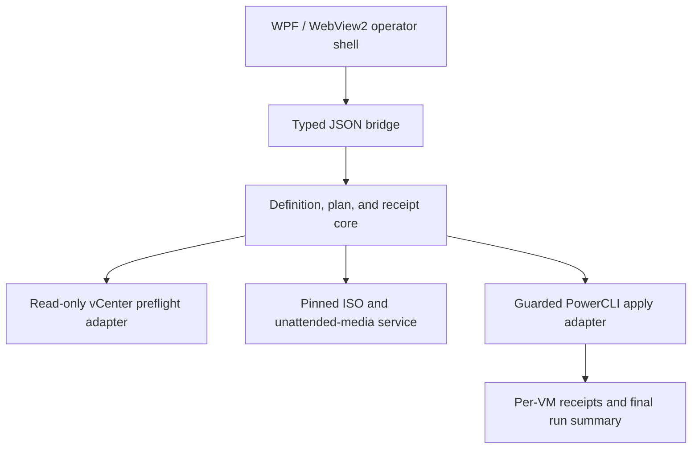

# Multi Install ISO Application Plan

## Decision

Rebuild the project as a guarded .NET 8 WPF/WebView2 operator application while stabilizing the current PowerShell planning engine in small, testable changes.

The current repository is approved for offline planning work only. Provisioning remains locked until the apply-stage gates and non-production proof are complete.

## Target architecture

The UI does not construct free-form infrastructure commands. Backend adapters receive typed requests and return typed, redacted results.

## Safety contract

- `Plan` reads local definitions and writes a plan. It does not contact vCenter.
- `Preflight` is read-only and resolves every named vCenter object.
- `Apply` requires the reviewed plan hash, exact target, explicit confirmation, and valid dependency state.
- Each VM is an independent state machine with before, action, readback, and receipt records.
- A failure stops the next VM. Cleanup is explicit and never inferred.
- Secrets are referenced by credential slot and never written to plans, logs, diagnostics, or command lines.

## Phased implementation

### Phase 0 — Stabilize planning

Status: **ACTIVE**

| Work item | Status | Acceptance gate |
| --- | --- | --- |
| Support `powershell-yaml` hashtable output | Complete | `cluster-vms.yaml -PlanOnly` returns four VMs with zero issues. |
| Add offline planning regression tests | Complete | YAML and JSON planning tests pass without vCenter access. |
| Write the plan before any apply action | Next | A forced first-VM failure still leaves the immutable plan and attempt receipt. |
| Detect duplicate VM names and invalid numeric values | Pending | Invalid definitions fail before artifact or infrastructure work. |
| Remove automatic unpinned module installation | Pending | Missing dependencies fail with exact installation guidance. |
| Bring the main script to the PowerShell 7 and ScriptForge contract | Pending | Parser passes; ScriptForge has zero failures. |

### Phase 1 — Extract the application core

Status: **PENDING**

- Create typed definition, validation, plan, preflight, run, VM-state, and receipt models.
- Use one parser implementation for the app and PowerShell entry point.
- Validate YAML, JSON, and CSV against the same normalized contract.
- Hash the normalized definition and immutable plan.
- Add unit tests for empty, malformed, duplicate, partial, and mixed-validity definitions.

Gate: the core library produces identical normalized plans from equivalent YAML, JSON, and CSV inputs.

### Phase 2 — Build the operator shell

Status: **PENDING**

- Replace the WinForms prototype with a .NET 8 WPF/WebView2 host.
- Keep workflow UI in local `wwwroot` assets behind a typed bridge.
- Show version, environment, target, run mode, dependency state, credential state, and last receipt on the first screen.
- Provide Definition, Plan, Preflight, Apply, Receipts, Dependencies, Credentials, and Help views.
- Use Arctic Steel styling with keyboard navigation and accessible status states.

Gate: the published app opens offline, validates a definition, renders a plan, and copies redacted diagnostics.

### Phase 3 — Make installation media real

Status: **PENDING**

- Replace runtime `master` downloads with a pinned ISO acquisition provider.
- Verify HTTPS source, expected metadata, size, and SHA-256 before use.
- Generate Windows unattended files without silently producing empty fallback XML.
- Apply restricted ACLs and a documented cleanup lifecycle to sensitive artifacts.
- Implement the selected vSphere answer-media path: generated ISO, datastore floppy, or secondary CD image.
- Verify the media is attached and connected before power-on.

Gate: a non-production VM boots from the verified ISO and consumes the generated answer file.

### Phase 4 — Guarded vSphere execution

Status: **PENDING**

- Resolve vCenter, datacenter, cluster, host, datastore, network, folder, ISO, and existing VM collisions during read-only preflight.
- Present exact targets and blockers before enabling Apply.
- Require an exact confirmation phrase tied to the plan hash and vCenter target.
- Provision one VM at a time with readback after every state-changing action.
- Record partial results without automatic destructive rollback.

Gate: a bounded non-production run creates one VM, attaches verified media, reads back configuration, and writes a complete receipt.

### Phase 5 — Post-deployment and credentials

Status: **PENDING**

- Declare every required and optional dependency and credential slot.
- Load credentials through the approved MicDrop credential order.
- Remove PATs and passwords from free-form arguments and process logs.
- Make guest configuration a separate, resumable stage.
- Treat native process nonzero exits as failures and verify resulting services and content.

Gate: missing, undecryptable, rejected, expired, and permission-denied credentials produce distinct operator failures without exposing secret values.

### Phase 6 — Release proof

Status: **PENDING**

- Add unit, mocked adapter, security, definition, and receipt-schema tests.
- Run ScriptForge and Valhalla style/security/build validators.
- Publish self-contained, single-file `win-x64` output.
- Add `--smoke` and an offline management smoke path.
- Display the application version and produce SHA-256 hashes.
- Package the app, dependencies manifest, README, and deployment script.
- Verify the canonical launcher points to the tested published executable.

Gate: restore, build, publish, smoke, version, hash, package, and launcher readback all pass from the same commit.

## Required decisions before Phase 3

1. Select the vSphere answer-media method: generated ISO, datastore-backed floppy, or secondary CD image.
2. Identify one non-production vCenter, cluster, datastore, network, and disposable VM naming prefix for bounded proof.
3. Confirm the credential slot names for vCenter and optional domain join.
4. Decide whether Terraform and Kubernetes remain supported adapters or move to separate tools.

## Definition of done

The project is ready only when the published application can plan offline, preflight read-only, execute one approved non-production VM build, verify the resulting VM/media state, stop safely on failure, and produce redacted durable receipts from the exact shipped executable.
